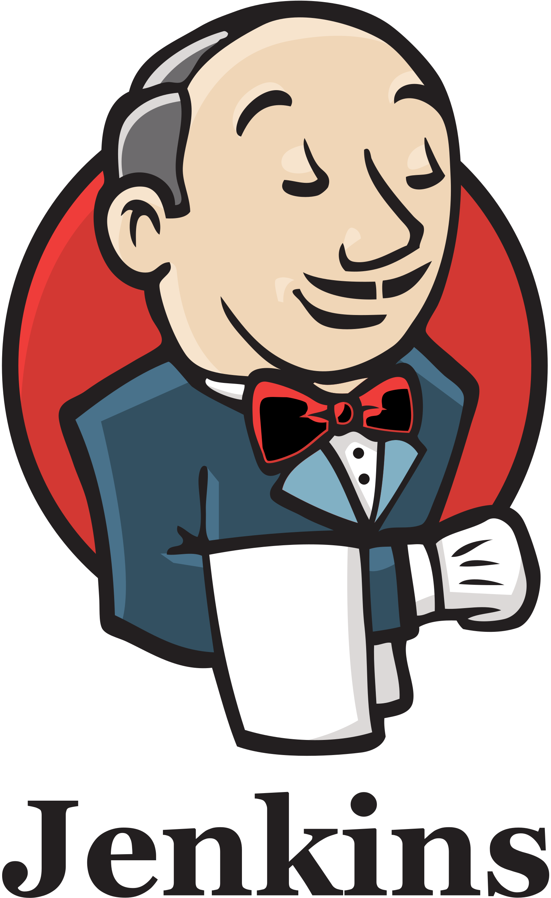

<h1 align="center">Hi there, I'm <a target="_blank">Rustam</a> 
</h1>
<h3 align="center">Junior QAA Engineer</h3>
<h4 align="left">Here you can see some of my projects.</h4>  

## Stack:  

<code></code>
<code></code>
<code></code>
<code></code>
<code></code>
<code></code>
<code></code>
<code></code>
<code></code>

## Languages  

  

